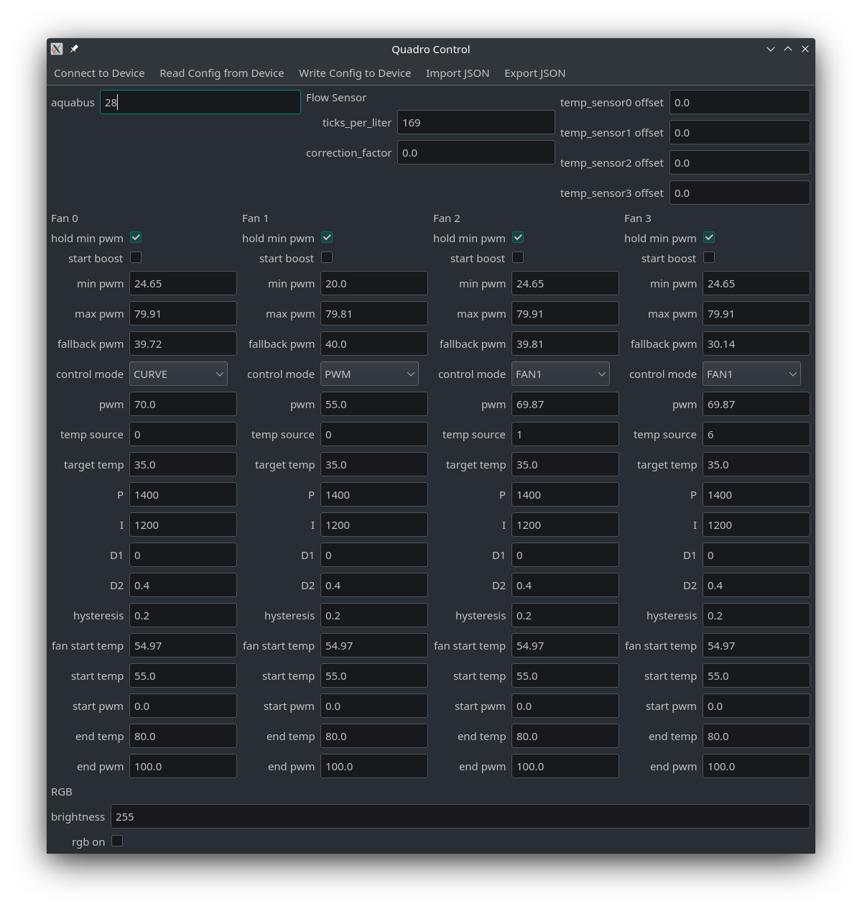

# aquacomputer-quadro-control
Control aquacomputer quadro from linux.

Tested under Manjaro and Ubuntu 21.10 with aquacomputer quadro running firmware 1028.

## capabilities
- read current configuration from device
- import previously captured configuration (see capture config packets)
- easily change value of:
    - fan speed, control mode, control variables, ...
    - sensor correction
    - rgb brightness, rgb on/off

## not implemented
- full rgb controll
- config value validation (use at own risk)

## installation
- requirements:
    - python3
    - pip

```
git clone https://github.com/leoratte/aquacomputer-quadro-control.git
cd aquacomputer-quadro-control
python -m build
pip install .
```

- udev rule 
    - substitute `<group>` with own group
    - allows usage without root
    - may require reboot
```
echo 'SUBSYSTEM=="usb", ATTRS{idVendor}=="0c70", ATTRS{idProduct}=="f00d", GROUP="<group>", MODE="0660"' | sudo tee /lib/udev/rules.d/99-usb-quadro.rules
```

## usage
```
quadro-control
```
1. connect to device
2. read config from device
3. change values in form
4. write config to device



## CRC resources
- http://www.ross.net/crc/crcpaper.html
- https://www.cosc.canterbury.ac.nz/greg.ewing/essays/CRC-Reverse-Engineering.html
- https://reveng.sourceforge.io/
- https://media.ccc.de/v/eh16-27-how_to_reverese_crcs

## CRC properties
CRC-16/USB
